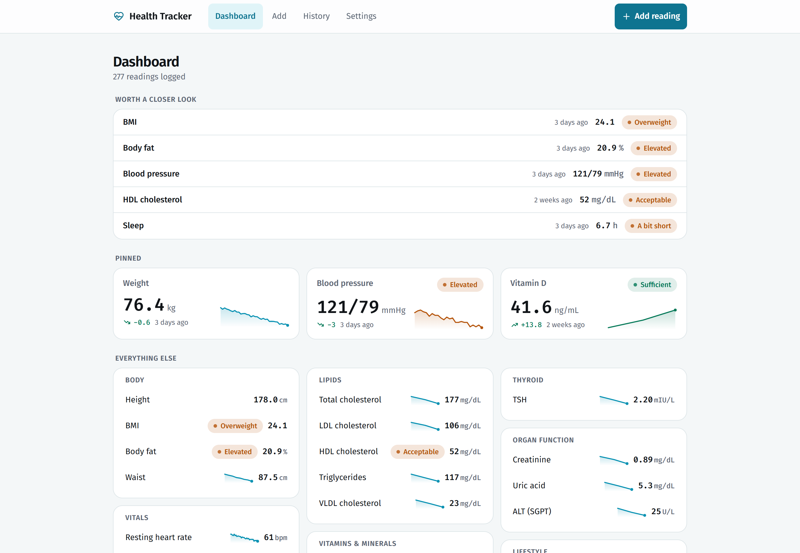
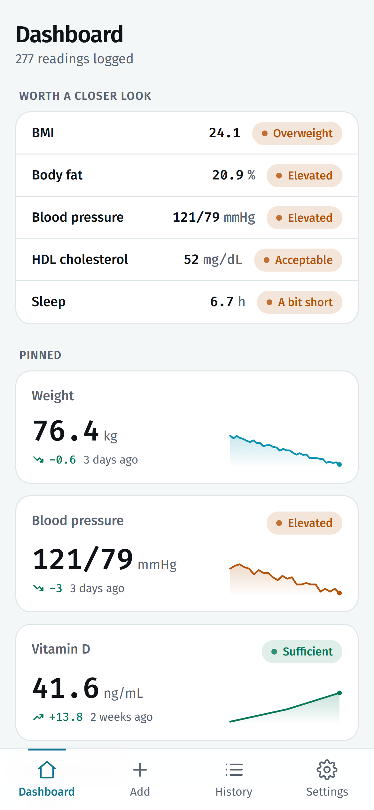
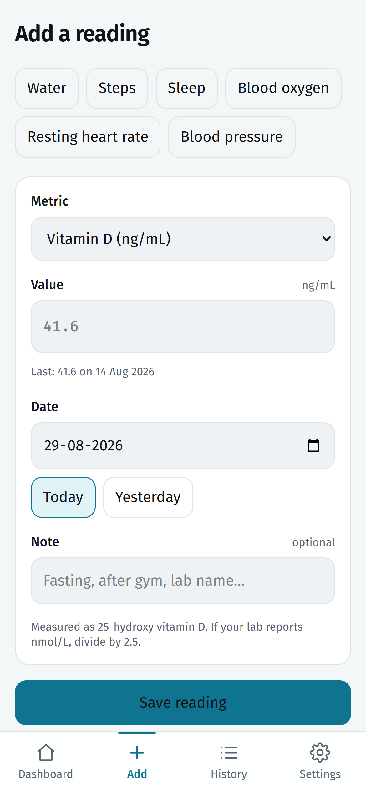
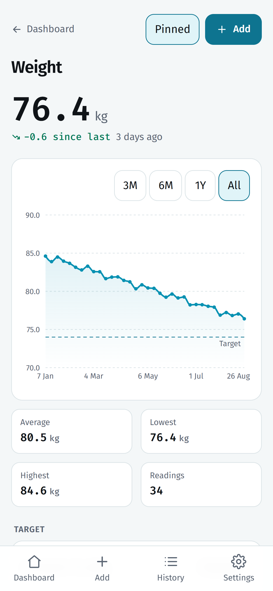
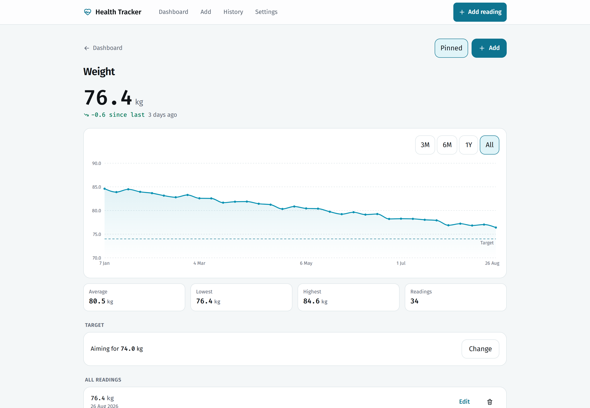
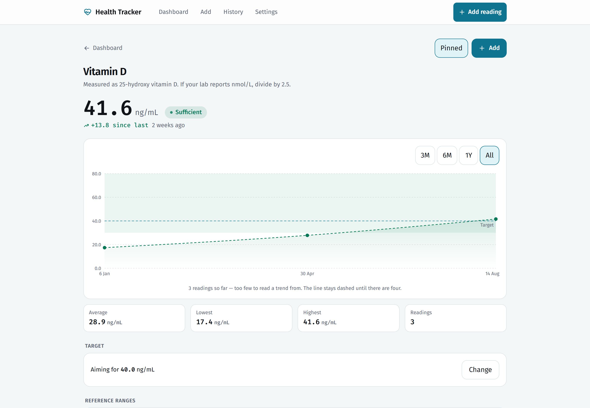
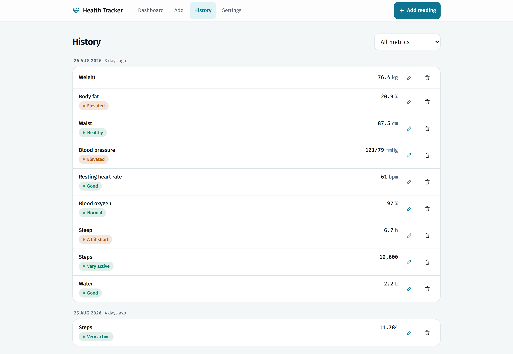
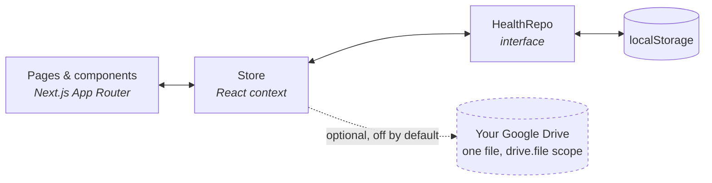

<div align="center">


# Health Tracker

**Log a reading. See how it moves. Know whether it sits in a healthy range.**

A personal health-metrics tracker built to be opened on a phone in five seconds
and read properly on a laptop. No account, no server, no database — your
readings live in your browser and go nowhere unless you tell them to.

[**Try the live demo →**](https://health-tracker-ssd.vercel.app)&nbsp;&nbsp;·&nbsp;&nbsp;[Deploy your own](#deploy-your-own)&nbsp;&nbsp;·&nbsp;&nbsp;[How it was built](#the-vibe-coded-part)

<br>


<br>

<picture>
  <source media="(prefers-color-scheme: dark)" srcset="docs/screenshots/dashboard-dark.png">
  
</picture>

<sub><i>The dashboard, with sample data. It follows your system theme — this screenshot does too.</i></sub>

</div>

<br>

## Why this exists

Health numbers arrive scattered and stay scattered. A lab report as a PDF in
email, a blood-pressure cuff that remembers nothing, a weight you noted in a
chat with yourself. Each number is meaningless alone: `34.1 ng/mL` is either
fine or a problem depending on which metric it is, and you have to look that up
every single time.

This app does two things about that. It keeps every reading in one place, and it
knows the reference range for each one — so `34.1 ng/mL` shows up as
**Sufficient**, and a chart shows you the range shaded behind the line.

<br>

## What it does

<table>
<tr>
<td width="50%" valign="top">

### 26 metrics, ready to use

Weight, height, body fat, waist, blood pressure, resting heart rate, SpO₂,
fasting glucose, HbA1c, the full lipid panel including VLDL, vitamin D, B12,
ferritin, hemoglobin, TSH, creatinine, uric acid, ALT, sleep, steps, water.

Grouped into eight categories so the dashboard stays readable as it fills up.

</td>
<td width="50%" valign="top">

### Reference ranges on every number

Each metric carries the common adult clinical cutoffs, in the units Indian labs
report. A reading is classified the moment you save it and shaded behind its
chart, so you read a word rather than look up a number.

</td>
</tr>
<tr>
<td width="50%" valign="top">

### BMI is calculated, never typed

Every weight reading is paired with whichever height was on record *on that
date* — so the BMI history is honest even if your height was measured
mid-series. WHO cutoffs or the lower South-Asian ones, your choice.

</td>
<td width="50%" valign="top">

### Charts that admit what they don't know

3M / 6M / 1Y / All windows, an optional target line, blood pressure drawn as two
lines. Under four readings the trend line stays dashed and says so, instead of
implying a trend from three dots.

</td>
</tr>
<tr>
<td width="50%" valign="top">

### A dashboard with a hierarchy

**Worth a closer look** surfaces what is out of range or overdue for a re-check.
**Pinned** holds the handful you actually watch. **Everything else** stays
grouped and quiet below.

</td>
<td width="50%" valign="top">

### Installs to your home screen

It is a PWA — add it to your home screen and it launches full-screen with its
own icon, works with no connection, and has app shortcuts straight to *Add a
reading*.

</td>
</tr>
<tr>
<td width="50%" valign="top">

### Open a whole lab report

A lipid panel is six trips through a form, which is where logging usually
stops. Open the PDF your lab emailed you instead — or paste the text, if you
prefer — and every reading it recognises comes out at once, with the collection
date read off the page and odd units converted. You check the rows before
anything is saved.

Both the PDF reading and the parsing are plain code running in your browser —
no model, no API call, no upload. A lab report is the most identifying thing
here, and it never leaves the device.

</td>
<td width="50%" valign="top">

### Tested where it matters

A wrong reference threshold does not crash anything — it quietly reports a
reading as *Normal* when it is not. So every clinical cutoff in the catalogue is
pinned by a test, alongside the BMI pairing, the date handling and the report
parser.

</td>
</tr>
</table>

<br>

### On a phone

<table>
<tr>
<td align="center" width="33%"><br><sub>Dashboard</sub></td>
<td align="center" width="33%"><br><sub>Add a reading</sub></td>
<td align="center" width="33%"><br><sub>A single metric</sub></td>
</tr>
</table>

### Charts and ranges

<table>
<tr>
<td width="50%"></td>
<td width="50%"></td>
</tr>
<tr>
<td width="50%"><sub><b>34 readings, a target line, and the window picker.</b> Averages, highs and lows are computed for whatever window you pick.</sub></td>
<td width="50%"><sub><b>The reference range, shaded.</b> Three lab draws climbing out of <i>Deficient</i>, through <i>Insufficient</i>, into <i>Sufficient</i> — the dashed line saying there is not yet enough here to call a trend.</sub></td>
</tr>
</table>

### Every reading, editable



<br>

## Use it

Three ways in, in increasing order of commitment.

**1. Open the demo.** [health-tracker-ssd.vercel.app](https://health-tracker-ssd.vercel.app)
— add a reading and it is yours, stored in your own browser. Nothing is sent
anywhere. Nobody else sees it, including me.

**2. Install it.** Open that link on your phone, then **Share → Add to Home
Screen**. It becomes an app: own icon, full screen, works on the Underground.

**3. Deploy your own.** Below. Two minutes, free tier, and then the URL is
yours rather than mine.

> **First run tip.** Log your **height** once — it is what turns every future
> weight reading into a BMI. Then pin the three or four metrics you actually
> care about; the dashboard reorganises itself around them.

<br>

## Deploy your own

The app is a Next.js build with no server, no database, and no required
environment variables. So deploying is genuinely just this:

[](https://vercel.com/new/clone?repository-url=https%3A%2F%2Fgithub.com%2Fsartaj1995%2Fhealth-tracker)

Or from your machine:

```bash
npx vercel
```

Or push your fork to GitHub and import it at [vercel.com/new](https://vercel.com/new)
— every default is already correct.

Any static-friendly host works too (Netlify, Cloudflare Pages, a Raspberry Pi on
your desk). There is no backend to stand up.

<br>

## Run it locally

```bash
git clone https://github.com/sartaj1995/health-tracker.git
cd health-tracker
npm install
npm run dev
```

Then open <http://localhost:3000>.

```bash
npm run build && npm start   # production build
npm test                     # the test suite
npm run lint                 # eslint
```

Node 18+ is all you need. No database to migrate, no `.env` to fill in, no API
keys — the app runs complete on a fresh clone.

### Tests

211 tests over the pure logic, run with `npm test` and on every pull request.

They exist mainly for one reason: a wrong reference threshold does not crash
anything. It quietly reports a reading as **Normal** when it is not, and there
is no way to notice. So every clinical boundary in the catalogue is pinned by a
test — HbA1c flipping to *Prediabetic range* at exactly 5.7, LDL to *Near
optimal* at 100, BMI to *Overweight* at 23 on South-Asian cutoffs and 25 on WHO.
Change a cutoff and a test goes red naming the one you moved.

The rest covers the logic that is easy to get subtly wrong: BMI pairing each
weight with the height that was on record *on that date*, dates anchored at
local midday so a timezone can never shift a reading a day, and backup parsing
dropping unreadable rows without failing an otherwise good restore.

<br>

## Where your data lives

By default: **in your browser's `localStorage`, and nowhere else.** No account,
no analytics, no telemetry, no network request that carries a reading. This is
also the honest limitation — your laptop and your phone are two separate stores
that never meet.

There are two ways across.

**Export / import.** *Settings → Export* gives you a JSON or CSV file. Import
the JSON on another device. Manual, but it is your data in a plain file you can
read.

**Google Drive backup.** Optional and off until you set it up. When on, the app
keeps a single file in *your own* Drive and re-uploads after every reading, so
two devices stay in step. It uses the `drive.file` scope, which grants access
only to files this app itself created — the rest of your Drive stays invisible
to it, and because Google classes that scope as non-sensitive there is no
verification review and no "unverified app" warning.

<details>
<summary><b>Setting up Drive backup</b> — about five minutes, needs its own Google Cloud project</summary>

<br>

> **Do not reuse a Google Cloud project from another app.** The OAuth consent
> screen is per-project, so a shared one would name the wrong app on the dialog
> you see when connecting, and the two apps would not be cleanly isolated. A new
> project is free.

1. At [console.cloud.google.com](https://console.cloud.google.com), create a new
   project — call it something like `health-tracker`.
2. **APIs & Services → Library**, search for **Google Drive API**, enable it.
3. **APIs & Services → OAuth consent screen.** Pick **External**, set the app
   name to `Health Tracker` (this is the name you will see when connecting), and
   add your own Google account under **Test users**.
4. **APIs & Services → Credentials → Create credentials → OAuth client ID.**
   Choose **Web application**.
5. Under **Authorised JavaScript origins**, add both:
   - `http://localhost:3000`
   - your deployed origin, e.g. `https://health-tracker-ssd.vercel.app`
6. Copy the client ID.

Locally, put it in `.env.local` (gitignored):

```bash
NEXT_PUBLIC_GOOGLE_CLIENT_ID=your-client-id.apps.googleusercontent.com
```

On Vercel, add the same name and value under **Settings → Environment
Variables**, then redeploy. The variable is `NEXT_PUBLIC_`, so it ships to the
browser — which is correct here: this OAuth flow has no client secret, and the
client ID is public by design.

Then open **Settings → Google Drive backup** and press **Connect**.

Without a client ID the feature stays hidden rather than half-working, and the
app behaves exactly as it does above.

</details>

<br>

## The vibe-coded part

**Every line of this app was written by [Claude Code](https://claude.com/claude-code).**
I did not write the components, the reference ranges, the chart code, or the
service worker. I described what I wanted, reviewed what came back, and said
what was wrong.

That is worth stating plainly rather than burying, because it is the more
interesting thing about this repository. The app is a weekend health tracker.
The process is the part that might change how you work.

### How it actually went

The whole thing was built the way you would build it with a colleague: one
branch per change, one pull request each, reviewed before merge.

| PR | What changed |
|:--|:--|
| [#1](https://github.com/sartaj1995/health-tracker/pull/1) | The app — 26 metrics, charts, dashboard, PWA, storage layer |
| [#2](https://github.com/sartaj1995/health-tracker/pull/2) | A full visual redesign, run against a vendored design skill |
| [#3](https://github.com/sartaj1995/health-tracker/pull/3) | VLDL added to the lipid panel |
| [#4](https://github.com/sartaj1995/health-tracker/pull/4) | Stop lowercasing acronyms in metric names |
| [#5](https://github.com/sartaj1995/health-tracker/pull/5) | Optional Google Drive backup |

### What it got right without being asked

The details I would have got wrong, or never thought about, in a weekend project:

- **BMI is paired with the height on record at the time of each weight
  reading**, not today's height. The naive version quietly rewrites your entire
  BMI history the day you re-measure yourself.
- **Dates are parsed at local midday**, so a timezone shift can never slide a
  reading into the previous day. There is a one-line comment in
  [`lib/stats.ts`](lib/stats.ts) explaining exactly that.
- **Storage sits behind a `HealthRepo` interface** in
  [`lib/storage.ts`](lib/storage.ts). `localStorage` is one implementation;
  pointing it at an API route later is a new implementation and zero page
  changes. That seam is why Drive backup landed as an additive PR.
- **Corrupt or unavailable storage starts clean instead of crashing** — private
  mode, blown quota, a half-written JSON blob.
- **Three readings do not get a trend line.** The chart goes dashed and says
  why.

### Where it needed steering

- It shipped metric labels through a title-case helper, which turned `LDL` into
  `Ldl` and `HbA1c` into `Hba1c`. Correct-looking code, wrong for this domain.
  Fixed in [#4](https://github.com/sartaj1995/health-tracker/pull/4).
- The dashboard was a flat list that grew every time a metric was added, until
  it was unreadable at 26. Giving it a hierarchy — *worth a closer look*,
  *pinned*, *everything else* — took an explicit instruction. The agent will
  keep adding to a structure long after the structure has stopped working.
- The redesign only became coherent once it had a design system to work
  against, rather than "make it look better". The skills it used are committed
  in [`.claude/skills/`](.claude/skills) so the visual language is reproducible
  rather than a lucky roll.

### If you want to build one

You do not need this repository. You need a clear description of what you want
and the willingness to reject the first answer. What made the difference here:

1. **Say what the thing is for, not what to build.** "Opened on a phone in five
   seconds, read properly on a laptop" shaped more decisions than any component
   spec would have.
2. **One change, one branch, one PR.** It keeps each diff small enough to
   actually read, and a bad direction costs you one branch instead of an
   afternoon.
3. **Review the domain logic, not the syntax.** The code compiles. What needs
   your eyes is whether `LDL` is spelled right and whether the BMI maths is
   defensible.
4. **Commit your skills and config.** [`.claude/`](.claude) is in this repo, so
   the next session starts where the last one ended.

<br>

## How it's built



About 4,100 lines of TypeScript, no state library, no component library, no
backend.

| Path | What lives there |
|:--|:--|
| [`lib/metrics.ts`](lib/metrics.ts) | All 26 metrics and their reference bands — the heart of the app |
| [`lib/types.ts`](lib/types.ts) | `Metric`, `Band`, `Entry`, `Profile` |
| [`lib/stats.ts`](lib/stats.ts) | Series building, derived BMI, summaries |
| [`lib/storage.ts`](lib/storage.ts) | The `HealthRepo` seam and its `localStorage` implementation |
| [`lib/drive.ts`](lib/drive.ts) · [`lib/sync.ts`](lib/sync.ts) | Google Drive OAuth and backup sync |
| [`lib/labImport.ts`](lib/labImport.ts) | Reads a pasted lab report into readings |
| [`app/`](app) | Dashboard, add, import, history, settings, and `/m/[id]` per metric |
| [`components/`](components) | Cards, rows, charts, sparklines, form |
| [`public/sw.js`](public/sw.js) | The service worker — caches the shell, nothing else |

### Adding a metric

Metrics are data, not code. One object in
[`lib/metrics.ts`](lib/metrics.ts) gives you an entry in the picker, a
dashboard row, a chart with shaded bands, a status pill, and a page at
`/m/<id>`:

```ts
{
  id: "vitaminD",
  label: "Vitamin D",
  unit: "ng/mL",
  category: "Vitamins & minerals",
  direction: "up",          // which way is an improvement
  decimals: 1,
  step: 0.1,
  min: 1,
  max: 200,
  bands: [
    { to: 20,   level: "bad",  label: "Deficient" },
    { to: 30,   level: "warn", label: "Insufficient" },
    { to: 100,  level: "good", label: "Sufficient" },
    { to: null, level: "warn", label: "Very high" },
  ],
  help: "Measured as 25-hydroxy vitamin D. If your lab reports nmol/L, divide by 2.5.",
}
```

`to` is the exclusive upper bound; the last band uses `null`. That is the whole
API.

<br>

## A word on the numbers

The reference ranges here are the common adult clinical cutoffs, in the units
Indian labs report. Several genuinely depend on age, sex and pregnancy — those
carry a note in the app.

**They are here to give a reading context at a glance. They are not a
diagnosis.** A pill that says *Elevated* means the number sits above a
population cutoff, which is a reason to talk to a doctor and never a substitute
for it. This app is not a medical device and has not been reviewed by anyone
qualified to call it one.

<br>

## Licence

[MIT](LICENSE) — fork it, change the metrics to the ones your labs actually
report, deploy it under your own name. No attribution needed, though a link
back is always nice.

The warranty disclaimer in the licence is not boilerplate here: this app tells
you a number looks *Elevated*. Read the section above before you rely on it.

<br>

---

<div align="center">
<sub>Built with <a href="https://claude.com/claude-code">Claude Code</a>. Every line of it.</sub>
</div>
